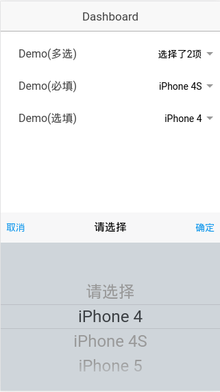
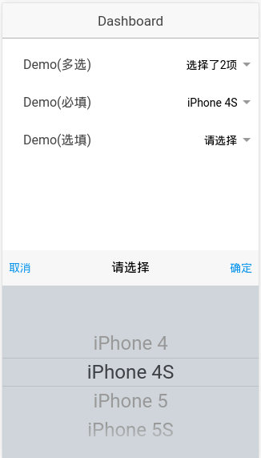
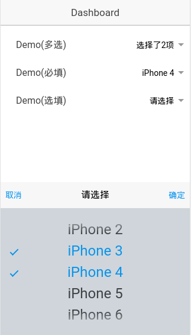

# ionic-picker
该插件在[`SUI Picker`](http://m.sui.taobao.org/components/#picker) 的基础上修改而来

## 运行
1. 运行 `npm install` 安装必要的插件
2. 运行 `gulp sass` 编译生成css文件
2. 运行 `ionic serve` 

## 使用
```html
<ionic-picker label="Demo(multi)"
                    multiple="true"
                    view-value-property="name"
                    picker-data="pickerData" ng-model="param.selectMultiData">
</ionic-picker>
```
### 属性说明
* `label`: `String` (必填)该多选的标签， 在`input-label`中显示.(必填)
* `multiple`: `Boolean` (必填) 是否多选
* `picker-data`: `Array` (必填) 用于选择的数据。
* `view-value-property`: `Boolean` (选填)用于显示值(viewValue)的属性名, 当传入的数组的每个元素是对象时，需要填写
* `ng-model`: `String|Object`, (选填) 选择结构绑定的model
* `required`: (选填) 是否是必填，只要写了这个属性，就表示是必填

## 运行效果截图
* 单选非必填

* 单选必填

* 多选


